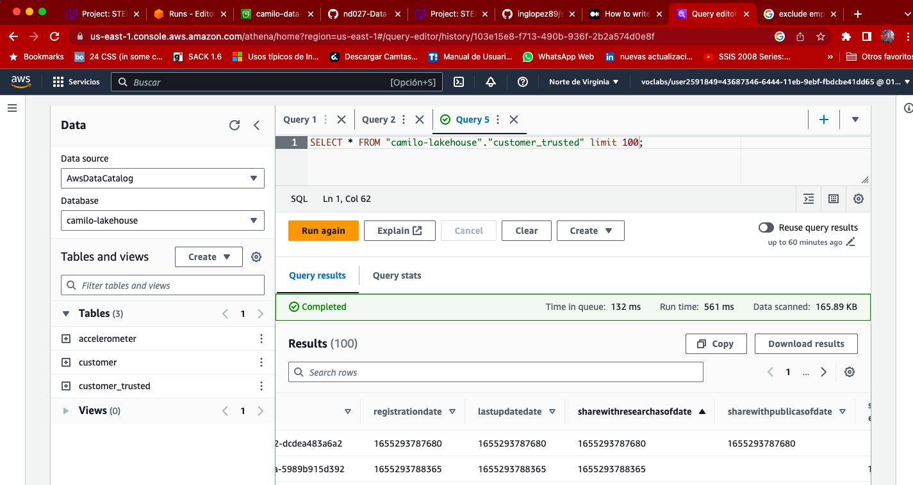
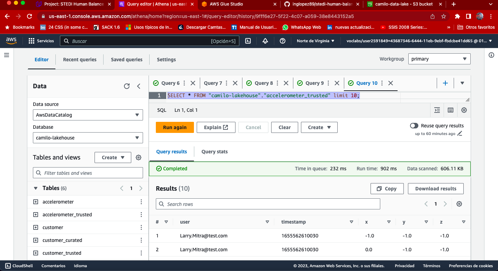
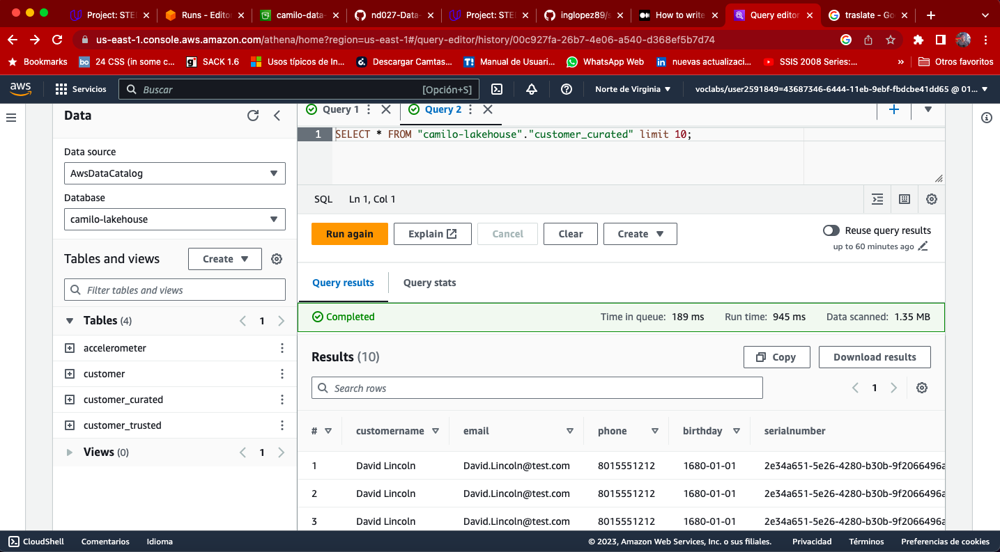

# This is the steps for STEDI project 

## Create IAM Role for read from data lake s3 with glue jobs

%204.03.31%20a.m..png)

## Copy files from stedi project starter to camilo-Data-Lake landing zone for accelerometer, customer and step_trainer

### Accelerometer

%2011.57.37%20p.m..png)

### Customer

%2012.07.23%20a.m..png)

### Step_trainer

%2012.09.43%20a.m..png)

## Create glue tables for lakehouse 

### Customer

%2012.58.17%20a.m..png)

Script glue table customer

[Customer sql](./sql/customer_landing.sql)

Create glue crawler for sync date from datalake zone to glue table

%2012.58.17%20a.m..png)

### Accelerometer

%201.19.10%20a.m..png)

Script glue table customer

[Accelerometer sql](./sql/accelerometer_landing.sql)

Create glue crawler for sync date from datalake zone to glue table

%201.13.00%20a.m..png)

### Preview Customer & Accelerometer

Athena query result

* Accelerometer

%201.21.53%20a.m..png)

* Customer

%2011.16.59%20a.m..png)

## Spark glue job for transfor customer from landing to trusted

### Customer glue job execution

* Spark glue Job Customer trusted
[Spark_glue_job_customer_trusted](./glue/customer_trusted-etl-spark.py)

%202.02.45%20a.m..png)

* Athena query result customer trusted

* spark glue Job accelerometer trusted

[spark_job_accelerometer_trusted](./glue/accelerometer_trusted.py)

%208.34.07%20a.m..png)

* Athena query result accelerometer trusted

* Spark glue job customer curated

[Spark_glue_job_customer_curated](./glue/customer_curated-etl-spark.py)

%203.49.00%20a.m..png)

* Athena query result customer curated

* Spark glue job step_trainer

[spark-glue-job-step-trainer](./glue/step_trainer_trusted-etl-apark.py)

%204.22.23%20a.m..png)

